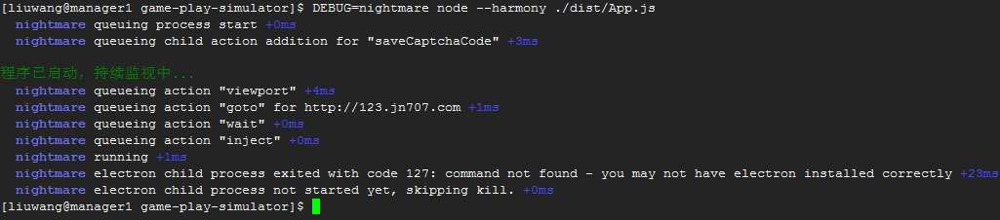
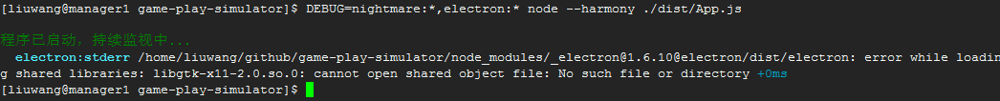

# ES6-Promise
### `javascript`中的`Promise`对象如何理解
Promise是构建在异步基础之上的组件，只是对异步处理对象进行了再次封装，使其更加抽象，方便使用。实际操作中离不开异步操作，所以说异步操作必不可少，不能说有了Promise就不存在异步，记住Promise是用来抽象异步对象的，它是一个组件，并不是和异步操作一样必不可少. 换句话说，可以没有Promise，但绝对存在异步。

### `Promise`中有趣的`then`方法
`promise`对象后面跟多个`then()`，程序不会报错，还是能继续运行，但是取过一次then中的值，后面再调用then就取不到值了

### 如何结束掉`Promise`的链式，并且不抛异常
通过`reject`方法即可，在`catch`方法中捕获到错误并处理即可，不一定非要通过`throw`的方式来实现

### 链接编程中的return
```javascript
function getCaptchaCode() {
   //这个return 表示 getCaptchaCode方法对外界的返回值
   return nightmare
        .viewport(80, 80)
        .goto('https://123.jn707.com/verifyCode?' + Math.random())
        .screenshot(captchaName)
        .end(function () {
            //这个 return 表示执行内部方法的返回值
            return new Promise(function (resolve, reject) {
                captchaDecoder.decoder(function (captchaCode) {
                    resolve(captchaCode.pic_str);
                });
            });
        });
}
```
### `Promise.All`参数中的`Promise`执行顺序问题
参数中的`Promise`不按照顺序执行，如果`Promise`嵌套，则顺序的执行更是不控的

###`Promise.All`中的数组参数初始化

```
let arr=[primise1,promise2];//这种会先执行内部的Promise
```


#nightmare、CentOS、electron
### `nightmare`和`electron`执行时的进程关系

`nightmare`执行时用的是`node`进程，是主进程，而`electron`是其调用的子进程，所以在用`setinterval`方法时发现，浏览器窗口虽然已经被关闭了，但是主进程依然在运行。但是从命令行了直接结束`nightmare`主进程后，`electron`浏览器进程也会同时结束掉

### `nightmare`程序在`centos`无法启动，如何查看具体错误信息

进入`nightmare`的`debug`模式，在`linux`的终端中输入

```shell
DEBUG=nightmare node ./dist/App.js
```

如下图所示



上面的语句只能查看到`nightmare`出现的错误，如果需要查看`electron`子进程的错误，需要执行命令

```shell
DEBUG=nightmare*,electron* node ./dist/App.js
```

如下图所示



### `linux` 下运行`nightmare`或`electron`需要安装的依赖

参考文档：<https://github.com/electron/electron/blob/master/docs/development/build-instructions-linux.md#build-instructions-linux>