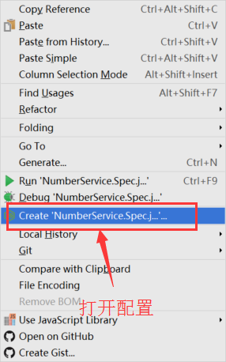
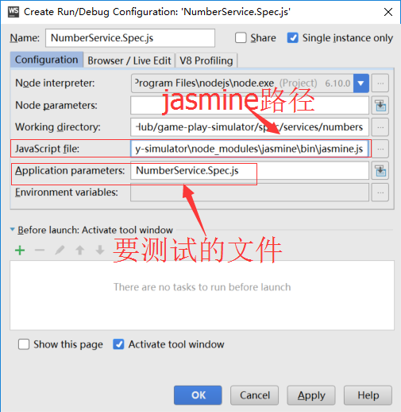
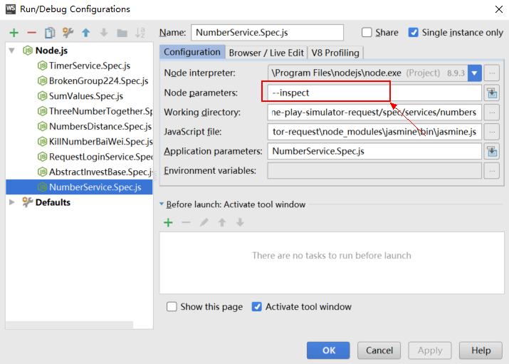

## 使用nvm管理多个node版本

参考链接[nvm-windows](https://www.sitepoint.com/quick-tip-multiple-versions-node-nvm/)

1. 查看可用的node版本

   ```shell
   nvm ls available
   ```

2. 安装特定的node版本

   ```shell
   nvm install 6.9.3
   ```

3. 卸载特定版本node

   ```shell
   nvm uninstall 6.9.3
   ```

4. 切换node版本

   ```shell
   nvm use 6.9.3   #使用特定版本
   nvm use node   #使用最新的node版本
   ```

5. 查看已经安装的node版本

   ```shell
   nvm ls  #查看所有本机安装的所以node版本
   nvm current  #查看当前使用的node版本
   ```

6. 通过`.nvmrc`文件在项目中指定使用的node版本

## WebStorm下调试Jasmine测试代码

打开`jasmine`的文件，右键选择`create<filename>`



配置`jasmine`路径



Node 8.0以后调试的时候可能提示
```shell
node: bad option: --expose_debug_as=v8debug
```
解决方法：在node参数配置中添加`--inspect`  


## Linux环境的debug输出

```shell
DEBUG=nightmare*,electron* node ./dist/App.js
```

## Windows环境下debug输出

```shell
set DEBUG=nightmare*,electron* && node ./dist/App.js
```

## Windows环境下移除debug输出

```shell
set DEBUG=-*    
```

> `window`下的`set`命令是针对当前命令行的，关闭窗口后，重新打开一个新的窗口，`debug`模式就自然失效了
>
> `-`表示排除，详细请参照文档：<https://www.npmjs.com/package/debug>


## Log4js在调试时的使用

在`src/config/log4js.json`中可以设置在程序运行时显示那种类型的日志信息，通过修改`categories`属性中的`level`节点即可

```json
{
  "appenders": {
    "out": {
      "type": "stdout"
    },
    "app": {
      "type": "file",
      "filename": "application.log"
    }
  },
  "categories": {
    "default": {
      "appenders": [
        "out",
        "app"
      ],
       // 修改这里的level值即可实现日志的输出  
       // off:不输出任何日志 error:只输出错误日志
       // 所有的取值：ALL < TRACE < DEBUG < INFO < WARN < ERROR < FATAL < MARK < OFF
      "level": "debug"  
    }
  }
}
```

具体设置可参考[log4js官方文档](https://nomiddlename.github.io/log4js-node/api.html)